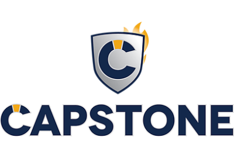

# capstone1
AWS Restart Project
<!-- PROJECT LOGO -->
 

      

  <h3 align="center">README</h3>

<!-- TABLE OF CONTENTS -->

  
Table of Contents

  <ol>
    <li>
      <a href="#about-the-project">About The Project</a>
      <ul>
        <li><a href="#built-with">Built With</a></li>
      </ul>
    </li>
    <li>
      <a href="#getting-started">Getting Started</a>
      <ul>
        <li><a href="#prerequisites">Prerequisites</a></li>
      </ul>
    </li>
    <li><a href="#contributing">Contributors</a></li>
    <li><a href="#contact">Contact</a></li>
    <li><a href="#acknowledgements">Acknowledgements</a></li>
  </ol>

<!-- ABOUT THE PROJECT -->
## About The Project

Capstone LTD relies on printed catalogues and other non-digital marketing mediums to help showcase their products and/or servicesand reach their customers. 
However, due to the pandemic and its disruptions on the mailing sector, Capstone LTD has decided to create a digital platform to display their wide rangeof products. 
Capstone LTDhopesthis platform will eventually grow tobe their main platform for communication with their customers and sales generation.
The benefits include: 
- A more diversified outreach for Capstone, which means more sales generation. 
- An online presence, which would also mean the beginning of a stronger brand equity and loyalty as they already have a good reputation with existing customers.

### Built With

- Adobe Dreamweaver as the IDE
- HTML
- CSS
- PHP - For the contact us form submission.

<!-- GETTING STARTED -->
## Getting Started

To design this website:
- Install Adobe Dreamweaver (it's a subscription service)
- Install wamp server to run the PHP content.
- Create a folder for your project in the www folder in the wamp folder.
- Create a new site on Dreamweaver and specify the location of your website which is the location of your project folder.
- Create a folder to store your css file in your project folder.
- Create a folder to store your images in your project folder.

### Prerequisites
To design this website you need to have:
- Basic understanding of HTML, CSS, and PHP
- Ability to search the internet for CSS codes.

<!-- CONTRIBUTING -->
## Contributing
- Afiza Ibram provided the diagram for the website which formed the structure of the website.
- Alan Scherer provided the textual content and images for the website and provided valuable feedback on the website design.
- Ninioritse Tuedon developed the website.
- Abraham Musinga provided valuable feedback on the web design as well as some of the web content.

<!-- CONTACT -->
## Contact

Your Name - Ninioritse E. Tuedon - netuedon@gmail.com

Project Link: [https://github.com/praisestar/capstone1](https://github.com/praisestar/capstone1)

<!-- ACKNOWLEDGEMENTS -->
## Acknowledgements
* IN4 Group
* AWS Restart
